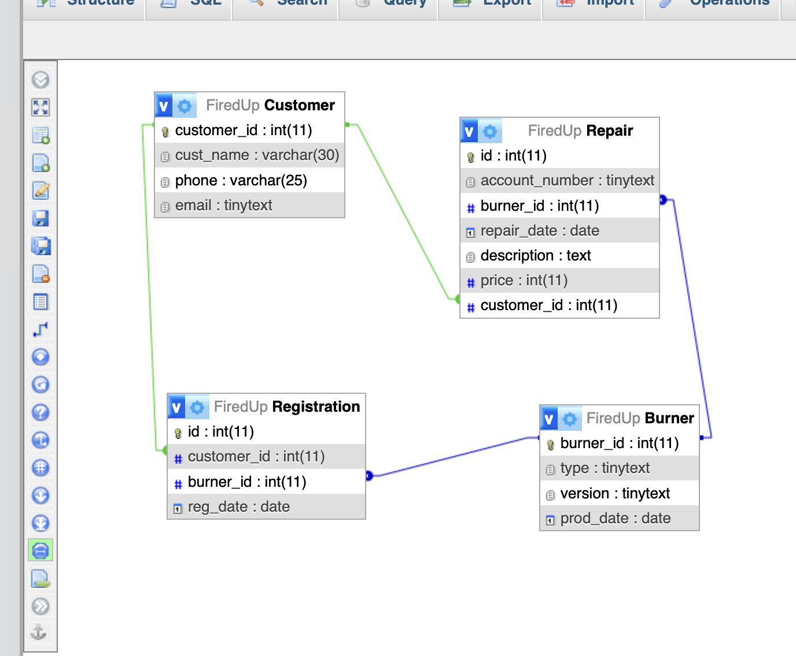
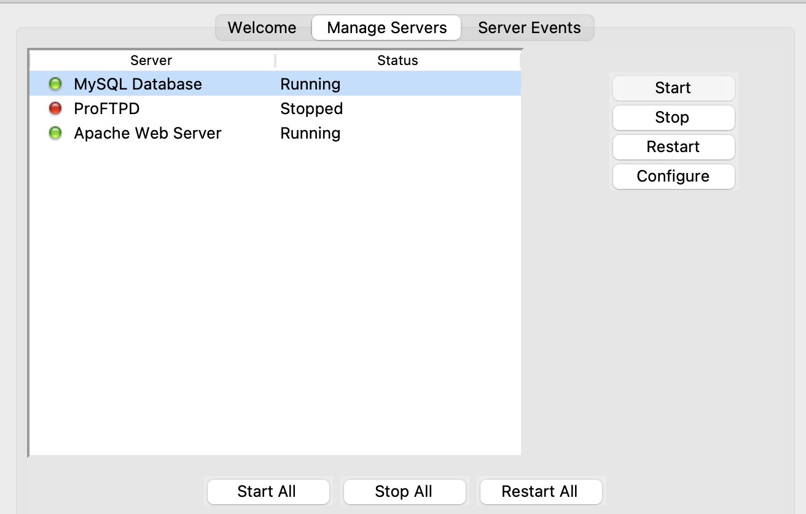
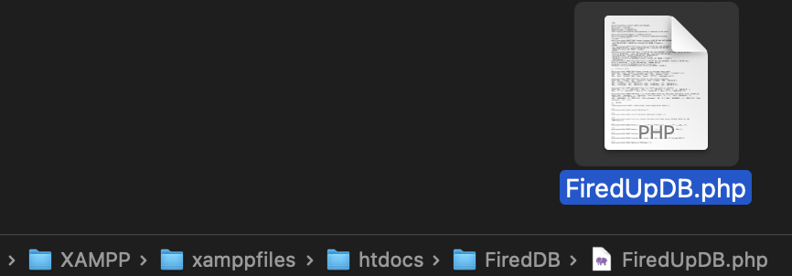
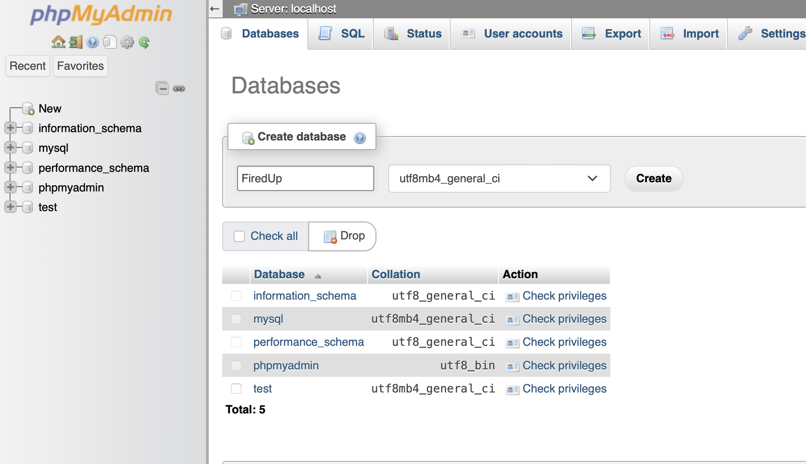
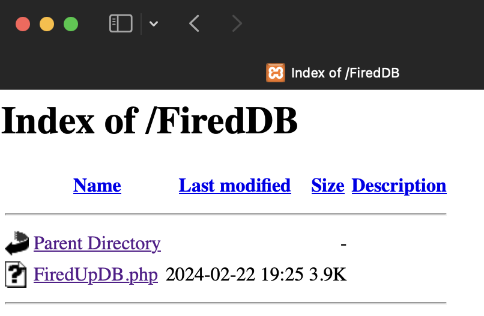
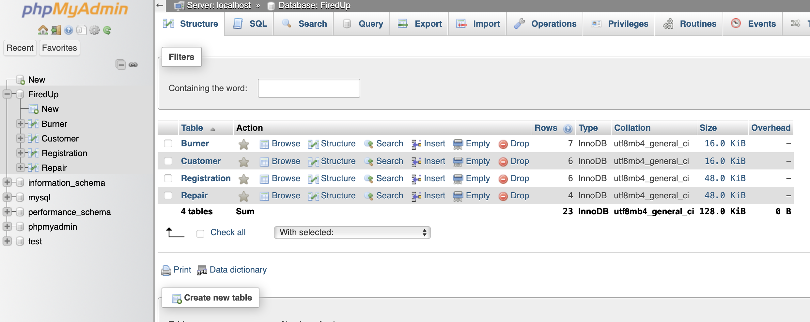
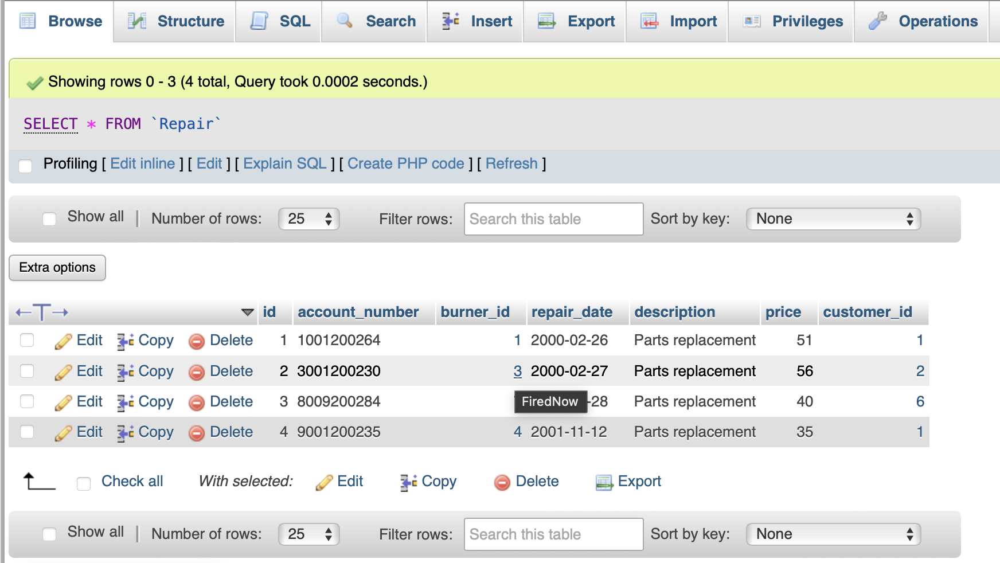
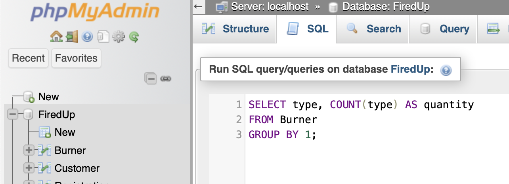
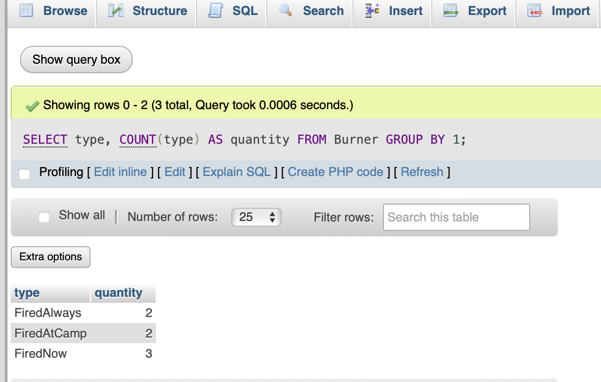

# MySQL Database 
## Uploading a databse to a local server is written using **PHP** and creating a database using **SQL**. 
### Database for a small company **Fired Up** that sells burners.
### Fired Up Database is Relational Database. 
**Relationships between tables** 

### This databse can be used for learning how to write SQL queries.

## Instalation

1. Install XAMPP.

2. Open XAMPP Control panel and start **Apache Web Server** and **MySQL Database**.

3. Extract the folder with the file in `C:\xampp\htdocs`.

4. Open any browser and type `localhost/phpmyadmin`.

5. Click on **New** at side navbar.
6. Give a database name as `FiredUp` and hit on **Create** button.

7. After creating database name open browser and type localhost/ and your folder name which is located in `C:\xampp\htdocs`, in my case `http://localhost/FiredDB/`

8. Your file will appear on the screen, click on it.

9. Open browser and type `localhost/phpmyadmin` again.

10. Click on **FiredUp** at side navbar and will open a database with four tables.

11. You can open any table by clicking on it.

For examle table **Repair**

## Relationships

12. 5. Click on **Designer** at top database navbar to see relationships between tables. 

## Queries
13. To write queries you need click on **SQL** at top navbar.

14. Example of query result output.

## If you like my project hit a star button)